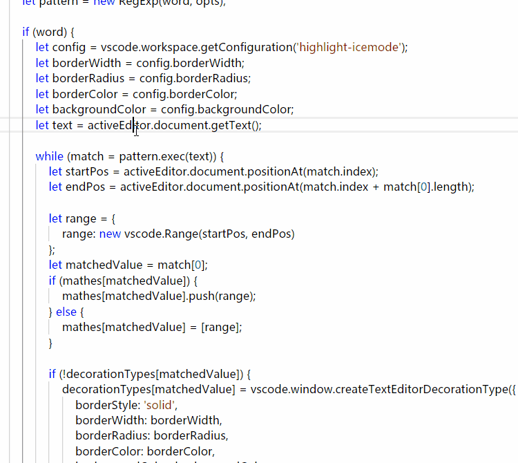

### What's this

This is a `highlight select words` plugin for Visual Studio Code.It's very useful when you are reading code.

Current project you see, is based on [highlight-icemode](https://github.com/EsIce/highlight-icemode)

Thanks for original author.

### My Changes

- Whole English chars , underlines  and numbers use exact match
- Ignore whitespace in start of chars or end of chars
- Some attributes have been extended

### Preview

### Issue

I cannot get the fold flag when the chars in  the block like `// #region ...`,because the plugin should highlight the folder flag when the chars exist in the hidden block.